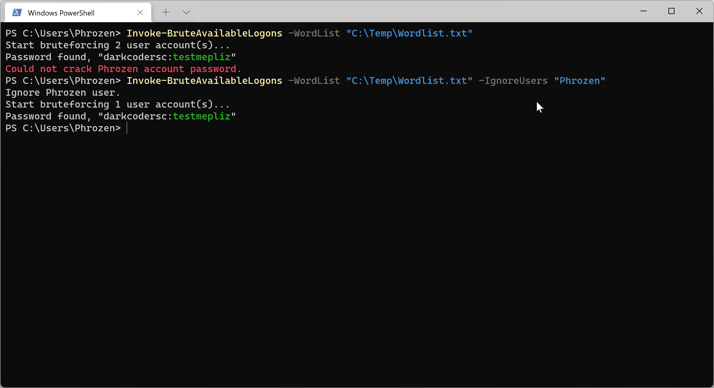
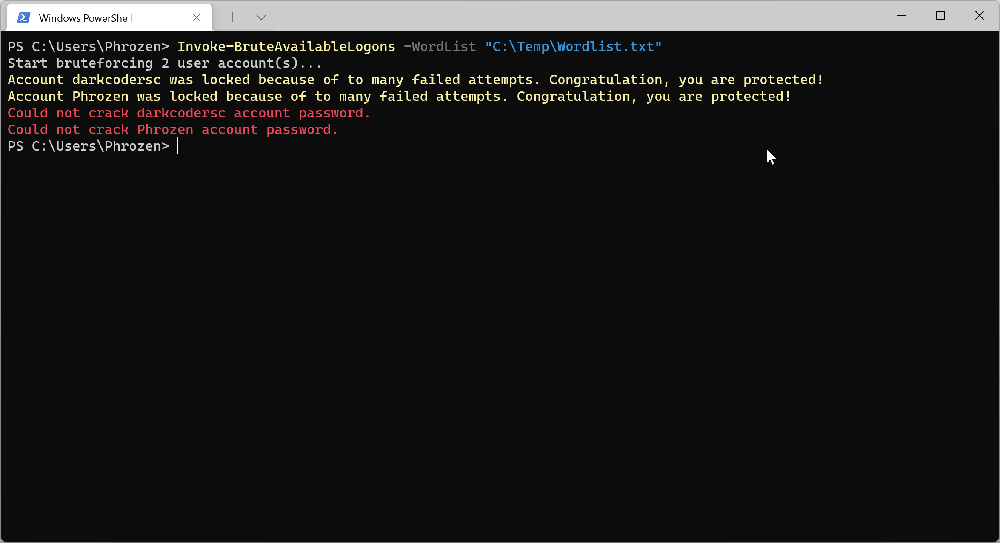

# PowerBruteLogon

PowerBruteLogon is a ported version of [WinBruteLogon](https://github.com/DarkCoderSc/win-brute-logon) in pure PowerShell

Notice that this version is slower than WinBruteLogon but has the advantage to be 100% coded in PowerShell. In a near future, I will try to implement jobs to improve the speed of logon testing.

Be aware that both WinBruteLogon and PowerBruteLogon are very noisy, each failed attempt will result in a new "Bad Logon" log entry on Windows.

For more information about the whole concept behind this project, please read the following [article](https://www.phrozen.io/paper/proof-of-concept/bruteforce-windows-logon-poc)

## Usage

You can use this script both as a PowerShell Module or Raw Script (Pasted, from Encoded Base64 String, DownloadString(...) etc...).

### As a Module

Choose a registered PowerShell Module location (see `echo $env:PSModulePath`)

Create a folder called `PowerBruteLogon` and place the `PowerBruteLogon.psm1` file inside the new folder.

Open a new PowerShell Window and enter `Import-Module PowerBruteLogon`

The module should be imported with available functions

* Invoke-BruteLogonAccount
* Invoke-BruteLogonList
* Invoke-BruteAvailableLogons

### As a Raw Script

You can import this script alternatively by:

* Pasting the whole code to a new PowerShell window
* Importing a Base64 encoded version of the code through `IEX/Invoke-Expression`
* Remote Location through `DownloadString(...)` then `IEX/Invoke-Expression`
* Your imagination

### Available Commands

#### `Invoke-BruteLogonAccount`

Attempt to recover the password of a single available and enabled Microsoft Windows User Account.

##### Parameters

* `Username` (MANDATORY): Target Microsoft Windows User Account (Existing + Enabled)
* `WordList` (MANDATORY): Plain text file containg the list of password to test

##### Example

`Invoke-BruteLogonAccount -Username "darkcodersc" -Wordlist "C:\Temp\Wordlist.txt"`


#### `Invoke-BruteLogonList`

Attempt to recover the password of a list of available and enabled Microsoft Windows User Accounts.

##### Parameters

* `UserList` (MANDATORY): Plain text file containing the list of user account to test
* `WordList` (MANDATORY): Plain text file containing the list of password to test

##### Example

`Invoke-BruteLogonList -UserList "C:\Temp\users.txt" -WordList "C:\Temp\Wordlist.txt"`


#### `Invoke-BruteAvailableLogons`

Probably the best option, attempt to recover the password of available and enabled local accounts.

You can specifiy a list of user to ignore.

##### Parameters

* `WordList` (MANDATORY): Plain text file containing the list of password to test
* `IgnoreUsers` (OPTIONAL): A list of user to ignore during user lookup

##### Examples

`Invoke-BruteAvailableLogons -WordList "C:\Temp\Wordlist.txt"`

`Invoke-BruteAvailableLogons -WordList "C:\Temp\Wordlist.txt" -IgnoreUsers "Phrozen"`



## Account Lockout Behaviour

PowerBruteLogon supports account lockout detection. When enabled (recommended), after a certain amount of fail attempt it will try to lookup for account lockout and notify to screen.

Example:

`Invoke-BruteAvailableLogons -WordList "C:\Temp\Wordlist.txt"`



## Remove progress bar

In some circumstances, you might be annoyed by the progressbar. You can safely remove it at this location:

```PowerShell
# Display Progress / Stats
$perc = [math]::Round((100 * $currPos) / $candidateCount)
$activity = [string]::Format("Testing candidate ""{0}"" for username ""{1}""", $candidate, $targetUser)
$status = [string]::Format("$perc% Complete:{0}/{1}", $currPos, $candidateCount)

Write-Progress -Activity $activity -Status $status -PercentComplete $perc
```
